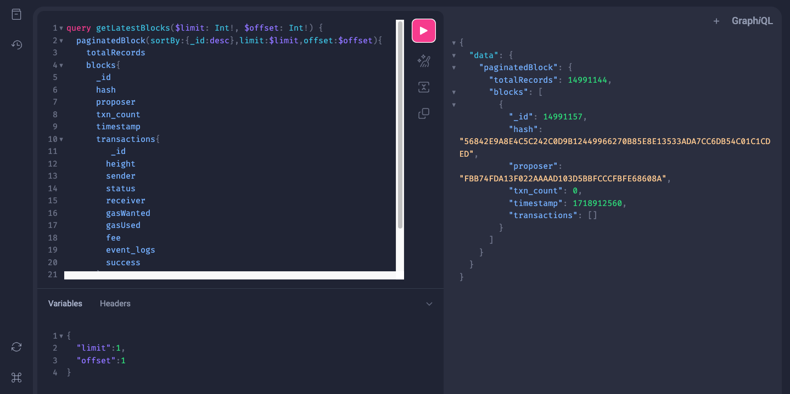

# How to fetch data using GQL Playground

You can try the GraphQL queries by using the following link - [https://devnet-explorer-api.routerprotocol.com/gql](https://devnet-explorer-api.routerprotocol.com/gql). “Docs” section can be referred from the right top of the page and the various available  query endpoints can be looked at.




<details>
<summary><b>Blocks</b></summary>

### Overview

To query the data for blocks, you can use the blocks query. Below we have provided a few sample queries on how you can fetch desired blocks data using GraphQL.

### To get the latest blocks

To get the latest blocks from the explorer you can use the below query. The parameters offset and limit can be passed as required to get the outcome needed.

:::tip
The parameters can be set in the “Query Variables” section on the GraphQL playground. An example to set the parameters is as below - {"limit": 1, "offset": 1}
:::

**Request**

```jsx
query getLatestBlocks($limit: Int!, $offset: Int!) {
  paginatedBlock(sortBy:{_id:desc},limit:$limit,offset:$offset){
    totalRecords
    blocks{
      _id
      hash
      proposer
      txn_count
      timestamp
      transactions{
         _id
        height
        sender
        status
        receiver
        timeStamp
        gasWanted
        gasUsed
        fee
        event_logs
        success
      }
    }
  }
}
```

**Response**

```jsx
{
  "data": {
    "paginatedBlock": {
      "totalRecords": 15641,
      "blocks": [
        {
          "_id": 15641,
          "hash": "1C6BC272B52029A27D574A9E68269E9079A6E33AD4DBC3B4754874CE6EE4B0E6",
          "proposer": "4EC53962072D60BE17C849C98902EC05B22076E4",
          "txn_count": 0,
          "timestamp": "2023-01-02T08:55:57Z",
          "transactions": []
        }
      ]
    }
  }
}
```

### To get a specific block’s data

**Request**

```jsx
query getBlockByHeight($height: Int!){
  block(_id:$height){
    _id
    hash
    proposer
    txn_count
    timestamp
  }
}
```

**Response**

```jsx
{
  "data": {
    "block": {
      "_id": 1234,
      "hash": "92144B399796060CF32831077D34C5F3F67275E57572218B5BFC9BEDDDD0F44B",
      "proposer": "12B6CFEA58C5A3BC8CB194F4AE4E4610827083FC",
      "txn_count": 0,
      "timestamp": "2023-01-02T01:30:33Z"
    }
  }
}
```

</details>

<details>
<summary><b>Transactions</b></summary>

### Overview

To query the data for transactions, you can use the below examples. 

### To get the latest transactions data

To get the latest transactions from the explorer you can use the below query. The parameters offset and limit can be passed as required to get the outcome needed.

:::tip
The parameters can be set in the “Query Variables” section on the GraphQL playground. An example to set the parameters is as below -
{"limit": 1, "offset": 1}
:::

**Request**

```jsx
query getLatestTransactions($limit: Int!, $offset: Int!){
    paginatedTransaction(sortBy:{height:desc,timeStamp:desc},limit:$limit,offset:$offset){
    totalRecords
  transactions{
     _id
    height
    sender
    status
    receiver
    timeStamp
    gasWanted
    gasUsed
    fee
    event_logs
    success
    rawLog
    routePrice
  }
  }
}
```

**Response**

```jsx
{
  "data": {
    "paginatedTransaction": {
      "totalRecords": 17,
      "transactions": [
        {
          "_id": "4BB9D33522003683D23AF08A463248B77A65F0992C8FFAD730BD6F766B261E27",
          "height": 12886,
          "sender": "router1hvaau9fkk4xssmqe455mfujzd2hs6jnsy0rcdj",
          "status": "",
          "receiver": "router1gmj4z4vr3rn8ptzcumyycp6eegkuhehrlzlws2",
          "timeStamp": "2023-01-02T07:30:46Z",
          "gasWanted": "",
          "gasUsed": "",
          "fee": "100000000000000router",
          "event_logs": "",
          "success": "",
          "rawLog": "[{\"events\":[{\"type\":\"coin_received\",\"attributes\":[{\"key\":\"receiver\",\"value\":\"router1gmj4z4vr3rn8ptzcumyycp6eegkuhehrlzlws2\"},{\"key\":\"amount\",\"value\":\"1000000000000000000router\"}]},{\"type\":\"coin_spent\",\"attributes\":[{\"key\":\"spender\",\"value\":\"router1hvaau9fkk4xssmqe455mfujzd2hs6jnsy0rcdj\"},{\"key\":\"amount\",\"value\":\"1000000000000000000router\"}]},{\"type\":\"message\",\"attributes\":[{\"key\":\"action\",\"value\":\"/cosmos.bank.v1beta1.MsgSend\"},{\"key\":\"sender\",\"value\":\"router1hvaau9fkk4xssmqe455mfujzd2hs6jnsy0rcdj\"},{\"key\":\"module\",\"value\":\"bank\"}]},{\"type\":\"transfer\",\"attributes\":[{\"key\":\"recipient\",\"value\":\"router1gmj4z4vr3rn8ptzcumyycp6eegkuhehrlzlws2\"},{\"key\":\"sender\",\"value\":\"router1hvaau9fkk4xssmqe455mfujzd2hs6jnsy0rcdj\"},{\"key\":\"amount\",\"value\":\"1000000000000000000router\"}]}]}]",
          "routePrice": "1.7062257784837516"
        }
      ]
    }
  }
}
```

### To get a specific transaction’s data

**Request**

```jsx
query getTransactionByHash($hash: String!){
  transaction(_id:$hash){
	  _id
	  height
	  sender
	  status
	  receiver
	  timeStamp
	  gasWanted
	  gasUsed
	  fee
	  event_logs
	  success
  }
}
```

**Response**

```jsx
{
  "data": {
    "transaction": {
      "_id": "4BB9D33522003683D23AF08A463248B77A65F0992C8FFAD730BD6F766B261E27",
      "height": 12886,
      "sender": "router1hvaau9fkk4xssmqe455mfujzd2hs6jnsy0rcdj",
      "status": "",
      "receiver": "router1gmj4z4vr3rn8ptzcumyycp6eegkuhehrlzlws2",
      "timeStamp": "2023-01-02T07:30:46Z",
      "gasWanted": "",
      "gasUsed": "",
      "fee": "100000000000000router",
      "event_logs": "",
      "success": ""
    }
  }
}
```

</details>

<details>
<summary><b>Inbounds</b></summary>

### Overview

To query the data for inbound transactions, you can use the below examples. These are the transactions coming into Router chain from any other EVM/non-EVM chain.

### To get the latest inbounds data

To get the latest inbound transactions from the explorer you can use the below query. The parameters offset and limit can be passed as required to get the outcome needed.

:::tip
The parameters can be set in the “Query Variables” section on the GraphQL playground. An example to set the parameters is as below -
{"limit": 1, "offset": 1}
:::

**Request**

```jsx
query getLatestInbounds($limit: Int!, $offset: Int!){
    paginatedInbound(sortBy:{blockHeight:desc},limit:$limit,offset:$offset){
    totalRecords
    inbounds{
      attestationId
      chainType
      attestationType
      chainId
      eventNonce
      blockHeight
      sourceTxHash
      sourceSender
      routerBridgeContract
      payload
      status
      formAttestationId
      historyStatus{
        status
        txnHash
        timestamp
      }
      confirmations{
        validator
        txnHash
        timestamp
      }
    }
  }
}
```

**Response**

```jsx

```

### To get a specific inbound’s data

In order to get data for a specific inbound request using the attestation id, you can use the below query.

**Request**

```jsx
query getInboundByFormAttestationId($formAttestationId: String!){
  inbound(formAttestationId:$formAttestationId){
    attestationId
    chainType
    attestationType
    chainId
    eventNonce
    blockHeight
    sourceTxHash
    sourceSender
    routerBridgeContract
    payload
    status
    formAttestationId
    historyStatus{
        status
        txnHash
        timestamp
      }
      confirmations{
        validator
        txnHash
        timestamp
      }
  }
}
```

**Response**

```jsx

```

### To get a search inbound data

In case you need to search for inbound transactions using various parameters, below sample query which can be used. You can add or remove conditions based on the requirement.

**Request**

```jsx
query getLatestInbounds($searchTerm: String!,$limit: Int!, $offset: Int!){
    paginatedInbound(where_or:{sourceTxHash:$searchTerm,sourceSender:$searchTerm,routerBridgeContract:$searchTerm,formAttestationId:$searchTerm},sortBy:{blockHeight:desc},limit:$limit,offset:$offset){
    totalRecords
    inbounds{
      attestationId
      chainType
      attestationType
      chainId
      eventNonce
      blockHeight
      sourceTxHash
      sourceSender
      routerBridgeContract
      payload
      status
      formAttestationId
      historyStatus{
        status
        txnHash
        timestamp
      }
      confirmations{
        validator
        txnHash
        timestamp
      }
    }
  }
}
```

**Response**

```jsx

```

</details>

<details>
<summary><b>Outbounds</b></summary>

### Overview

To query the data for outbound transactions, you can use the below examples. These are the transactions from Router chain to any other EVM/non-EVM chain.

### To get the latest outbounds data

To get the latest inbound transactions from the explorer you can use the below query. The parameters offset and limit can be passed as required to get the outcome needed.

:::tip
The parameters can be set in the “Query Variables” section on the GraphQL playground. An example to set the parameters is as below -
{"limit": 1, "offset": 1}
:::

**Request**

```jsx
query getLatestOutbounds($limit: Int!, $offset: Int!){
    paginatedOutbound(sortBy:{blockHeight:desc},limit:$limit,offset:$offset){
    totalRecords
    outbounds{
      eventNonce
      destinationChainType
      destinationChainId
      relayerFee
      outgoingTxFee
      isAtomic
      sourceAddress
      expiryTimestamp
      status
      contractCalls
      ackFormAttestationId
      formAttestationId
      attestationId
      outgoingTxNonce
      outboundTxRequestedBy
      destinationTxHash
      feeConsumed
      blockHeight
      historyStatus{
        status
        txnHash
        timestamp
        blockHeight
      }
     outboundSignatures{
        validator
        txnHash
        timestamp
      	blockHeight
      }
      outboundACKSignatures{
        validator
        txnHash
        timestamp
      	blockHeight
      }
      contractsExecutionData{
        destContractAddress
        status
        payload
      }
      confirmations{
        validator
        txnHash
        timestamp
      	blockHeight
      }
      contractAckResponses
    }
    }
}
```

**Response**

```jsx

```

### To get a specific outbound’s data

In order to get data for a specific outbound request using the attestation id, you can use the below query.

**Request**

```jsx
query getOutboundByFormAttestationId($formAttestationId: String!){
  outbound(formAttestationId:$formAttestationId){
      eventNonce
      destinationChainType
      destinationChainId
      relayerFee
      outgoingTxFee
      isAtomic
      sourceAddress
      expiryTimestamp
      status
      contractCalls
      ackFormAttestationId
      formAttestationId
      attestationId
      outgoingTxNonce
      outboundTxRequestedBy
      destinationTxHash
      feeConsumed
      blockHeight
      historyStatus{
        status
        txnHash
        timestamp
        blockHeight
      }
     outboundSignatures{
        validator
        txnHash
        timestamp
      	blockHeight
      }
      outboundACKSignatures{
        validator
        txnHash
        timestamp
      	blockHeight
      }
      contractsExecutionData{
        destContractAddress
        status
        payload
      }
      confirmations{
        validator
        txnHash
        timestamp
      	blockHeight
      }
      contractAckResponses
  }
}
```

**Response**

```jsx

```

### To get a search outbound data

In case you need to search for outbound request using various parameters, below sample query which can be used. You can add or remove conditions based on the requirement.

**Request**

```jsx
query getLatestOutbounds($destinationChainType: String!,$destinationChainId: String!,$sourceAddress: String!,$limit: Int!, $offset: Int!){
    paginatedOutbound(where:{destinationChainType:$destinationChainType,destinationChainId:$destinationChainId,sourceAddress:$sourceAddress},sortBy:{blockHeight:desc},limit:$limit,offset:$offset){
    totalRecords
    outbounds{
      eventNonce
      destinationChainType
      destinationChainId
      relayerFee
      outgoingTxFee
      isAtomic
      sourceAddress
      expiryTimestamp
      status
      contractCalls
      ackFormAttestationId
      formAttestationId
      attestationId
      outgoingTxNonce
      outboundTxRequestedBy
      destinationTxHash
      feeConsumed
      blockHeight
      historyStatus{
        status
        txnHash
        timestamp
        blockHeight
      }
     outboundSignatures{
        validator
        txnHash
        timestamp
      	blockHeight
      }
      outboundACKSignatures{
        validator
        txnHash
        timestamp
      	blockHeight
      }
      contractsExecutionData{
        destContractAddress
        status
        payload
      }
      contractAckResponses
      confirmations{
        validator
        txnHash
        timestamp
      	blockHeight
      }
    }
    }
}
```

**Response**

```jsx

```

</details>