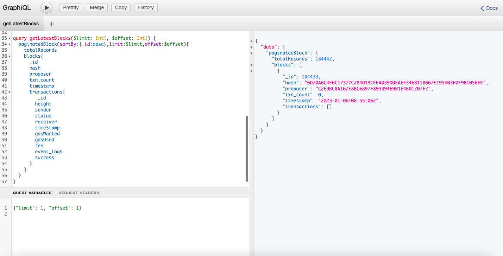

# How to fetch data using GQL Playground

Users can experiment with the GraphQL queries by accessing the provided link - [https://explorer-api.testnet.routerchain.dev/gql](https://explorer-api.testnet.routerchain.dev/gql). The "Docs" section, located in the top-right corner of the page, can be referenced for guidance, and users can explore the different available query endpoints.




<details>
<summary><b>Blocks</b></summary>

### Overview

To query block data, one can utilize the blocks query. Sample queries are provided below to demonstrate how desired block data can be fetched using GraphQL.

### To get the latest blocks

To obtain the most recent blocks from the explorer, one can utilize the provided query. The parameters "offset" and "limit" can be passed as necessary to obtain the desired outcome.

:::tip
The parameters can be set in the “Query Variables” section on the GraphQL playground. An example to set the parameters is as below - {"limit": 1, "offset": 1}
:::

**Request**

```jsx
query getLatestBlocks($limit: Int!, $offset: Int!) {
  paginatedBlock(sortBy:{_id:desc},limit:$limit,offset:$offset){
    totalRecords
    blocks{
      _id
      hash
      proposer
      txn_count
      timestamp
      transactions{
         _id
        height
        sender
        status
        receiver
        timeStamp
        gasWanted
        gasUsed
        fee
        event_logs
        success
      }
    }
  }
}
```

**Response**

```jsx
{
  "data": {
    "paginatedBlock": {
      "totalRecords": 15641,
      "blocks": [
        {
          "_id": 15641,
          "hash": "1C6BC272B52029A27D574A9E68269E9079A6E33AD4DBC3B4754874CE6EE4B0E6",
          "proposer": "4EC53962072D60BE17C849C98902EC05B22076E4",
          "txn_count": 0,
          "timestamp": "2023-01-02T08:55:57Z",
          "transactions": []
        }
      ]
    }
  }
}
```

### To get a specific block’s data

**Request**

```jsx
query getBlockByHeight($height: Int!){
  block(_id:$height){
    _id
    hash
    proposer
    txn_count
    timestamp
  }
}
```

**Response**

```jsx
{
  "data": {
    "block": {
      "_id": 1234,
      "hash": "92144B399796060CF32831077D34C5F3F67275E57572218B5BFC9BEDDDD0F44B",
      "proposer": "12B6CFEA58C5A3BC8CB194F4AE4E4610827083FC",
      "txn_count": 0,
      "timestamp": "2023-01-02T01:30:33Z"
    }
  }
}
```

</details>

<details>
<summary><b>Transactions</b></summary>

### Overview

To query transaction data, one can refer to the provided examples below.

### To get the latest transactions data

To obtain the most recent transactions from the explorer, the following query can be utilized. The parameters "offset" and "limit" can be passed as necessary to obtain the desired outcome.


:::tip
The parameters can be set in the “Query Variables” section on the GraphQL playground. An example to set the parameters is as below -
{"limit": 1, "offset": 1}
:::

**Request**

```jsx
query getLatestTransactions($limit: Int!, $offset: Int!){
    paginatedTransaction(sortBy:{height:desc,timeStamp:desc},limit:$limit,offset:$offset){
    totalRecords
  transactions{
     _id
    height
    sender
    status
    receiver
    timeStamp
    gasWanted
    gasUsed
    fee
    event_logs
    success
    rawLog
    routePrice
  }
  }
}
```

**Response**

```jsx
{
  "data": {
    "paginatedTransaction": {
      "totalRecords": 17,
      "transactions": [
        {
          "_id": "4BB9D33522003683D23AF08A463248B77A65F0992C8FFAD730BD6F766B261E27",
          "height": 12886,
          "sender": "router1hvaau9fkk4xssmqe455mfujzd2hs6jnsy0rcdj",
          "status": "",
          "receiver": "router1gmj4z4vr3rn8ptzcumyycp6eegkuhehrlzlws2",
          "timeStamp": "2023-01-02T07:30:46Z",
          "gasWanted": "",
          "gasUsed": "",
          "fee": "100000000000000router",
          "event_logs": "",
          "success": "",
          "rawLog": "[{\"events\":[{\"type\":\"coin_received\",\"attributes\":[{\"key\":\"receiver\",\"value\":\"router1gmj4z4vr3rn8ptzcumyycp6eegkuhehrlzlws2\"},{\"key\":\"amount\",\"value\":\"1000000000000000000router\"}]},{\"type\":\"coin_spent\",\"attributes\":[{\"key\":\"spender\",\"value\":\"router1hvaau9fkk4xssmqe455mfujzd2hs6jnsy0rcdj\"},{\"key\":\"amount\",\"value\":\"1000000000000000000router\"}]},{\"type\":\"message\",\"attributes\":[{\"key\":\"action\",\"value\":\"/cosmos.bank.v1beta1.MsgSend\"},{\"key\":\"sender\",\"value\":\"router1hvaau9fkk4xssmqe455mfujzd2hs6jnsy0rcdj\"},{\"key\":\"module\",\"value\":\"bank\"}]},{\"type\":\"transfer\",\"attributes\":[{\"key\":\"recipient\",\"value\":\"router1gmj4z4vr3rn8ptzcumyycp6eegkuhehrlzlws2\"},{\"key\":\"sender\",\"value\":\"router1hvaau9fkk4xssmqe455mfujzd2hs6jnsy0rcdj\"},{\"key\":\"amount\",\"value\":\"1000000000000000000router\"}]}]}]",
          "routePrice": "1.7062257784837516"
        }
      ]
    }
  }
}
```

### To get a specific transaction’s data

**Request**

```jsx
query getTransactionByHash($hash: String!){
  transaction(_id:$hash){
	  _id
	  height
	  sender
	  status
	  receiver
	  timeStamp
	  gasWanted
	  gasUsed
	  fee
	  event_logs
	  success
  }
}
```

**Response**

```jsx
{
  "data": {
    "transaction": {
      "_id": "4BB9D33522003683D23AF08A463248B77A65F0992C8FFAD730BD6F766B261E27",
      "height": 12886,
      "sender": "router1hvaau9fkk4xssmqe455mfujzd2hs6jnsy0rcdj",
      "status": "",
      "receiver": "router1gmj4z4vr3rn8ptzcumyycp6eegkuhehrlzlws2",
      "timeStamp": "2023-01-02T07:30:46Z",
      "gasWanted": "",
      "gasUsed": "",
      "fee": "100000000000000router",
      "event_logs": "",
      "success": ""
    }
  }
}
```

</details>

<details>
<summary><b>Cross-chain Transactions</b></summary>

### Overview

To query the data for cross-chain transactions, one can refer to the provided examples below.

### To get the latest cross-chain transaction data

To obtain the most recent cross-chain transactions from the explorer, utilize the following query. The parameters "offset" and "limit" can be adjusted according to your requirements to obtain the desired result.

:::tip
The parameters can be set in the “Query Variables” section on the GraphQL playground. An example to set the parameters is as below -
{"limit": 1, "offset": 1}
:::

**Request**

```jsx
query getLatestCrosschainTransactions($limit: Int!, $offset: Int!){
    paginatedCrosschain(sortBy:{blockHeight:desc},limit:$limit,offset:$offset){
    totalRecords
    crosschains {
      id
      blockHeight
      attestationId
      srcChainId
      srcTimestamp
      sourceTxHash
      srcTxOrigin
      requestSender
      requestPacket {
        handler
        payload
      }
      requestMetadata {
        destGasLimit
      }
      destChainId
      destinationTxHash
      execStatus
      execData
      status
      historyStatus{
        status
        txnHash
        timestamp
      }
      destTxFeeInRoute
      refundFeeInRoute
      relayerFeeInRoute
    }
  }
}
```

**Response**

```jsx
{
  "data": {
    "paginatedCrosschain": {
      "totalRecords": 8,
      "crosschains": [
        {
          "id": "80001-15",
          "blockHeight": 35612839,
          "attestationId": "",
          "srcChainId": "80001",
          "srcTimestamp": 1684132183,
          "sourceTxHash": "0xf659447c47ef79631f459658c2f6470a692b078ddce9bead568bc9ac12444b37",
          "srcTxOrigin": "0xAb771C0e0C33b8794BdE3a79568D829De399C094",
          "requestSender": "0x862f75cB828B21c9A2F406EEb7F5263C1E012700",
          "requestPacket": {
            "handler": "0xf57b1b6deB93b9aa73831cE896C427002E340Fe7",
            "payload": "AAAAAAAAAAAAAAAAAAAAAAAAAAAAAAAAAAAAAAAAAAUAAAAAAAAAAAAAAAAAAAAAAAAAAAAAAAAAAAAAAAAAQAAAAAAAAAAAAAAAAAAAAAAAAAAAAAAAAAAAAAAAAAAESG9sYQAAAAAAAAAAAAAAAAAAAAAAAAAAAAAAAAAAAAA"
          },
          "requestMetadata": {
            "destGasLimit": 1000000
          },
          "destChainId": "43113",
          "destinationTxHash": "0x6211f212d951fb50a0e0d6607dd51adde8790d003093968cacdbc6f9cedba996",
          "execStatus": true,
          "execData": "AAAAAAAAAAAAAAAAAAAAAAAAAAAAAAAAAAAAAAAAAAUAAAAAAAAAAAAAAAAAAAAAAAAAAAAAAAAAAAAAAAAAQAAAAAAAAAAAAAAAAAAAAAAAAAAAAAAAAAAAAAAAAAAESG9sYQAAAAAAAAAAAAAAAAAAAAAAAAAAAAAAAAAAAAA=",
          "status": "CROSSCHAIN_REQUEST_COMPLETED",
          "historyStatus": [
            {
              "status": "CROSSCHAIN_REQUEST_CREATED",
              "txnHash": "C3CF071C5B00610737E64342DC718AACF570C553516483C8F664B57E2150947F",
              "timestamp": 0
            },
            {
              "status": "CROSSCHAIN_REQUEST_CONFIRMED",
              "txnHash": "C3CF071C5B00610737E64342DC718AACF570C553516483C8F664B57E2150947F",
              "timestamp": 1684132193
            },
            {
              "status": "CROSSCHAIN_REQUEST_CONFIRMED",
              "txnHash": "F649961F8489EA6F47B6506CC5D76DF043897255744AB7BC38A4366608B1F8BB",
              "timestamp": 1684132193
            },
            {
              "status": "CROSSCHAIN_REQUEST_CONFIRMED",
              "txnHash": "748DFD51B7B4F91C9492E9EF08811DE97F6B5D5B159997D2DA33936454CABFE8",
              "timestamp": 1684132203
            },
            {
              "status": "CROSSCHAIN_REQUEST_OBSERVED",
              "txnHash": "",
              "timestamp": 1684132203
            },
            {
              "status": "CROSSCHAIN_REQUEST_READY_TO_EXECUTE",
              "txnHash": "",
              "timestamp": 0
            },
            {
              "status": "CROSSCHAIN_REQUEST_CONFIRMED",
              "txnHash": "9CF59274D5AB0ADCBCAB0A9CB84754C918781FE28F950EB98FB1D160FCF4E586",
              "timestamp": 1684132214
            },
            {
              "status": "CROSSCHAIN_REQUEST_EXECUTED",
              "txnHash": "",
              "timestamp": 0
            },
            {
              "status": "CROSSCHAIN_FEE_SETTLEMENT",
              "txnHash": "",
              "timestamp": 0
            },
            {
              "status": "CROSSCHAIN_REQUEST_COMPLETED",
              "txnHash": "",
              "timestamp": 1684132321
            }
          ],
          "destTxFeeInRoute": "163868613138686131",
          "refundFeeInRoute": "118855979562043796",
          "relayerFeeInRoute": "45012633576642335"
        }
      ]
    }
  }
}
```

### Search for specific cross-chain transaction data

If there is a need to search for specific cross-chain transactions using different parameters, the provided sample query can be used. Conditions can be added or removed as per the requirement.

**Request**

```jsx
query getCrosschainTransactionBySrcTxnHash($searchTerm: String!, $limit: Int!, $offset: Int!){
  paginatedCrosschain (where_or:{sourceTxHash:$searchTerm,requestSender:$searchTerm},sortBy:{blockHeight:desc},limit:$limit,offset:$offset){
    crosschains {
      id
      blockHeight
      attestationId
      srcChainId
      srcTimestamp
      sourceTxHash
      srcTxOrigin
      requestSender
      requestPacket {
        handler
        payload
      }
      requestMetadata {
        destGasLimit
      }
      destChainId
      destinationTxHash
      execStatus
      execData
      status
      historyStatus{
        status
        txnHash
        timestamp
      }
      destTxFeeInRoute
      refundFeeInRoute
      relayerFeeInRoute
    }
  }
}
```

**Response**

```jsx
{
  "data": {
    "paginatedCrosschain": {
      "crosschains": [
        {
          "id": "80001-15",
          "blockHeight": 35612839,
          "attestationId": "",
          "srcChainId": "80001",
          "srcTimestamp": 1684132183,
          "sourceTxHash": "0xf659447c47ef79631f459658c2f6470a692b078ddce9bead568bc9ac12444b37",
          "srcTxOrigin": "0xAb771C0e0C33b8794BdE3a79568D829De399C094",
          "requestSender": "0x862f75cB828B21c9A2F406EEb7F5263C1E012700",
          "requestPacket": {
            "handler": "0xf57b1b6deB93b9aa73831cE896C427002E340Fe7",
            "payload": "AAAAAAAAAAAAAAAAAAAAAAAAAAAAAAAAAAAAAAAAAAUAAAAAAAAAAAAAAAAAAAAAAAAAAAAAAAAAAAAAAAAAQAAAAAAAAAAAAAAAAAAAAAAAAAAAAAAAAAAAAAAAAAAESG9sYQAAAAAAAAAAAAAAAAAAAAAAAAAAAAAAAAAAAAA"
          },
          "requestMetadata": {
            "destGasLimit": 1000000
          },
          "destChainId": "43113",
          "destinationTxHash": "0x6211f212d951fb50a0e0d6607dd51adde8790d003093968cacdbc6f9cedba996",
          "execStatus": true,
          "execData": "AAAAAAAAAAAAAAAAAAAAAAAAAAAAAAAAAAAAAAAAAAUAAAAAAAAAAAAAAAAAAAAAAAAAAAAAAAAAAAAAAAAAQAAAAAAAAAAAAAAAAAAAAAAAAAAAAAAAAAAAAAAAAAAESG9sYQAAAAAAAAAAAAAAAAAAAAAAAAAAAAAAAAAAAAA=",
          "status": "CROSSCHAIN_REQUEST_COMPLETED",
          "historyStatus": [
            {
              "status": "CROSSCHAIN_REQUEST_CREATED",
              "txnHash": "C3CF071C5B00610737E64342DC718AACF570C553516483C8F664B57E2150947F",
              "timestamp": 0
            },
            {
              "status": "CROSSCHAIN_REQUEST_CONFIRMED",
              "txnHash": "C3CF071C5B00610737E64342DC718AACF570C553516483C8F664B57E2150947F",
              "timestamp": 1684132193
            },
            {
              "status": "CROSSCHAIN_REQUEST_CONFIRMED",
              "txnHash": "F649961F8489EA6F47B6506CC5D76DF043897255744AB7BC38A4366608B1F8BB",
              "timestamp": 1684132193
            },
            {
              "status": "CROSSCHAIN_REQUEST_CONFIRMED",
              "txnHash": "748DFD51B7B4F91C9492E9EF08811DE97F6B5D5B159997D2DA33936454CABFE8",
              "timestamp": 1684132203
            },
            {
              "status": "CROSSCHAIN_REQUEST_OBSERVED",
              "txnHash": "",
              "timestamp": 1684132203
            },
            {
              "status": "CROSSCHAIN_REQUEST_READY_TO_EXECUTE",
              "txnHash": "",
              "timestamp": 0
            },
            {
              "status": "CROSSCHAIN_REQUEST_CONFIRMED",
              "txnHash": "9CF59274D5AB0ADCBCAB0A9CB84754C918781FE28F950EB98FB1D160FCF4E586",
              "timestamp": 1684132214
            },
            {
              "status": "CROSSCHAIN_REQUEST_EXECUTED",
              "txnHash": "",
              "timestamp": 0
            },
            {
              "status": "CROSSCHAIN_FEE_SETTLEMENT",
              "txnHash": "",
              "timestamp": 0
            },
            {
              "status": "CROSSCHAIN_REQUEST_COMPLETED",
              "txnHash": "",
              "timestamp": 1684132321
            }
          ],
          "destTxFeeInRoute": "163868613138686131",
          "refundFeeInRoute": "118855979562043796",
          "relayerFeeInRoute": "45012633576642335"
        }
      ]
    }
  }
}
```

</details>